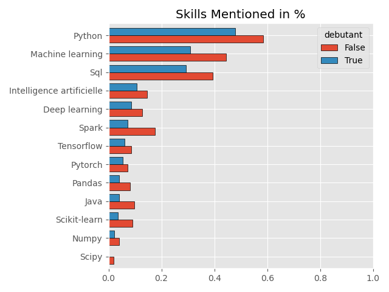

1088 offer with unpecified salary out of 1331
 # Salaires moyen :

- Salaire moyen : 48993.0 euros/ans soit 4083.0 par mois
- Salaire min moyen : 41996.0 euros/ans soit 3500.0 par mois
- Salaire max moyen : 55990.0 euros/ans soit 4666.0 par mois

# Salaires débutant :

- Salaire moyen : 40662.0 euros/ans soit 3388.0 par mois
- Salaire min moyen : 36638.0 euros/ans soit 3053.0 par mois
- Salaire max moyen : 44685.0 euros/ans soit 3724.0 par mois
# 

 

# Top skills
 