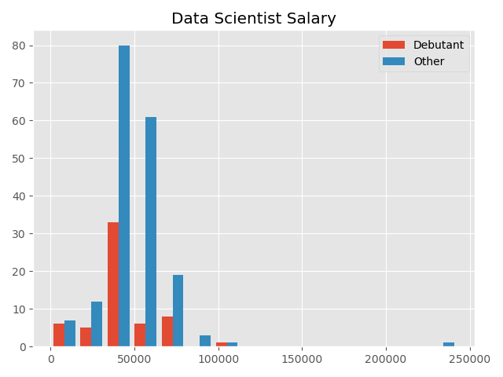

29 offer with unpecified salary out of 90
 # Salaires moyen :

- Salaire moyen : 48443.0 euros/ans soit 4037.0 par mois
- Salaire min moyen : 42623.0 euros/ans soit 3552.0 par mois
- Salaire max moyen : 54263.0 euros/ans soit 4522.0 par mois

# Salaires débutant :

- Salaire moyen : 38383.0 euros/ans soit 3199.0 par mois
- Salaire min moyen : 35221.0 euros/ans soit 2935.0 par mois
- Salaire max moyen : 41544.0 euros/ans soit 3462.0 par mois
# 

 

# Top skills
 